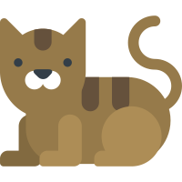

  
  

    
  

|Title|Instruction|
|---|:---:|
|项目名称   |智能儿童成长相册LifeCat 
|设计理念   |记录儿童成长过程中珍贵资料的管理平台
|项目架构   |Javaweb + Android + WeChat + Machine Learning + Hadoop
|项目主体   |Javaweb :v1(servlet), v2(ssm), v3(springboot+vue)
|项目作者   |Kevin ten

### 项目列表

[项目总服务在线网站](http://47.106.11.84)

  * Web-v1   
    * [jsp+servlet+mysql实现Javaweb](https://github.com/kevinten10/lifecatweb)   
    * [在线demo](http://www.lifecat.club:8080/lifecatweb/)
   
  * Web-v2
    * [ssm框架实现Javaweb后台管理系统](https://github.com/kevinten10/SSM-lifecat)  
    * [在线demo](http://www.lifecat.club:8080/ssm/)
  
  * Web-v3-Back
    * [前后端分离之Springboot实现Java后端开发](https://github.com/kevinten10/springboot-lifecat)  
  
  * Web-v3-Front 
    * [前后端分离之vue实现后台管理系统](https://github.com/kevinten10/Vue-Admin-lifecat)  
    * [在线demo](http://www.lifecat.club/admin)
  
  * Web-v3-Front 
    * [前后端分离之vue实现仿ins效果web开发](https://github.com/kevinten10/Web-lifecat)  
    * [在线demo](http://www.lifecat.club/lifecat)
  
  * Wechat 
    * [wechat 微信移动端小程序开发](https://github.com/kevinten10/WeChat-lifecat)  
    * 微信搜索小程序 :LifeCatTen
  
  * Hadoop 
    * [hadoop 分布式平台进行数据处理](https://github.com/kevinten10/Hadoop-lifecat)  
  
  * Android 
    * [android Android图像记录应用](https://github.com/kevinten10/Android-lifecat)  
  
  * Python 
    * [python 机器学习进行图像智能处理](https://github.com/kevinten10/Python-lifecat) 
   
### 项目架构

  
  
### 项目分层

  
  
### 