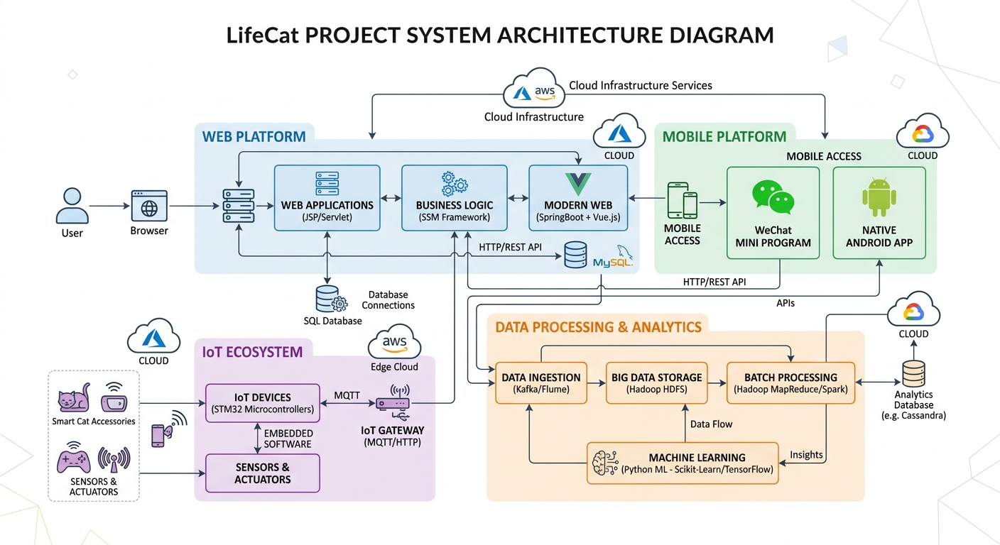
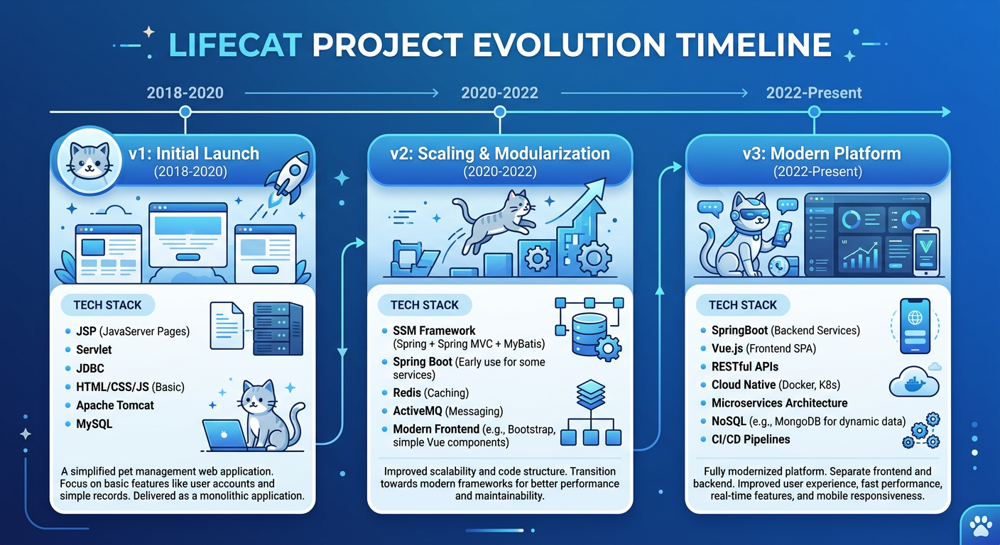

<p align="center">
  
</p>

<p align="center">
  
  
  
  
</p>

<h1 align="center">LifeCat 儿童成长相册管理系统</h1>

<p align="center">
  <strong>Javaweb + Android + WeChat + Machine Learning + IoT</strong>
</p>

---

## 📖 项目简介

**LifeCat** 是一个综合性的儿童成长相册管理系统，涵盖 Web、移动端、数据处理和智能硬件等多个平台。本项目最初作为 JavaWeb 学习项目，逐渐发展成为覆盖全栈技术的综合实践案例。

### 技术栈概览

| 领域 | 技术 |
|------|------|
| **Web 后端** | JSP/Servlet → SSM → SpringBoot |
| **Web 前端** | HTML/JS → Vue.js |
| **移动端** | Android, WeChat Mini Program |
| **大数据** | Hadoop, Spark |
| **机器学习** | Python, TensorFlow |
| **物联网** | STM32 Embedded |

---

## 🏗️ 系统架构

<p align="center">
  
</p>

### 架构层次

```
LifeCat/
├── lifecat-web/          # Web 前端 (Vue.js)
├── lifecat-server/       # 后端服务 (SpringBoot)
├── lifecat-ssm/          # SSM 框架版本
├── lifecat-servlet/      # JSP+Servlet 版本
├── lifecat-android/      # Android 应用
├── lifecat-wechat/       # 微信小程序
├── lifecat-python/       # Python 机器学习
├── lifecat-iot/          # STM32 物联网
├── lifecat-statistics/   # Hadoop 数据分析
├── lifecat-admin/        # 后台管理系统
└── docker/               # Docker 部署配置
```

---

## 🚀 项目演进

<p align="center">
  
</p>

### Web v1 - 基础版
**技术栈**: JSP + Servlet + MySQL
- 传统 JavaWeb 实现
- MVC 架构模式
- [源码](https://github.com/kevinten10/lifecatweb) | [在线演示](http://www.lifecat.club:8080/lifecatweb/)

### Web v2 - 框架版
**技术栈**: Spring + SpringMVC + MyBatis
- SSM 框架整合
- 后台管理系统
- [源码](https://github.com/kevinten10/SSM-lifecat) | [在线演示](http://www.lifecat.club:8080/ssm/)

### Web v3 - 前后端分离
**技术栈**: SpringBoot + Vue.js
- 现代化前后端分离架构
- RESTful API 设计
- **Admin 管理端**: [源码](https://github.com/kevinten10/Vue-Admin-lifecat) | [演示](http://www.lifecat.club/admin)
- **用户端**: [源码](https://github.com/kevinten10/Web-lifecat) | [演示](http://www.lifecat.club/lifecat)

---

## 📱 多端应用

### 微信小程序
- 微信搜索小程序: **LifeCatTen**
- [源码](https://github.com/kevinten10/WeChat-lifecat)

### Android 应用
- 原生 Android 图像记录应用
- [源码](https://github.com/kevinten10/Android-lifecat)

---

## 🔬 数据处理与智能分析

### Hadoop 大数据平台
- 分布式数据处理
- 用户行为分析
- [源码](https://github.com/kevinten10/Hadoop-lifecat)

### Python 机器学习
- 图像智能处理
- 人脸识别与分类
- [源码](https://github.com/kevinten10/Python-lifecat)

---

## 🔌 物联网设备

### STM32 嵌入式电子相册
- 硬件端相册展示
- 基于 STM32 微控制器
- [源码](https://github.com/kevinten10/Stm32-lifecat)

---

## 🎨 界面展示

<p align="center">
  
</p>

<p align="center">
  
</p>

<p align="center">
  
</p>

---

## 🌐 在线演示

**主站点**: [http://47.106.11.84](http://47.106.11.84)

| 项目 | 演示地址 |
|------|----------|
| Web v1 | http://www.lifecat.club:8080/lifecatweb/ |
| Web v2 | http://www.lifecat.club:8080/ssm/ |
| Web v3 Admin | http://www.lifecat.club/admin |
| Web v3 User | http://www.lifecat.club/lifecat |

---

## 🛠️ 快速开始

### 环境要求
- JDK 1.8+
- MySQL 5.7+
- Maven 3.6+
- Node.js 14+ (前端)

### 本地部署

```bash
# 1. 克隆项目
git clone https://github.com/lifecat-stack/Lifecat.git
cd Lifecat

# 2. 初始化数据库
mysql -u root -p < lifecat-doc/sql/init.sql

# 3. 启动后端 (SpringBoot)
cd lifecat-server
mvn spring-boot:run

# 4. 启动前端 (Vue)
cd ../lifecat-web
npm install
npm run dev
```

### Docker 部署

```bash
cd docker
docker-compose up -d
```

---

## 📚 文档

详细文档请查看 [lifecat-doc](./lifecat-doc/) 目录：
- [项目设计文档](./lifecat-doc/design/)
- [API 接口文档](./lifecat-doc/api/)
- [部署指南](./lifecat-doc/deploy/)

---

## 🤝 贡献指南

欢迎提交 Issue 和 Pull Request！

1. Fork 本仓库
2. 创建特性分支 (`git checkout -b feature/amazing-feature`)
3. 提交更改 (`git commit -m 'Add amazing feature'`)
4. 推送分支 (`git push origin feature/amazing-feature`)
5. 创建 Pull Request

---

## 📜 许可证

Copyright (c) 2017-present KevinTen

本项目采用 Apache License 2.0 许可证

---

<p align="center">
  <strong>记录每一个成长的瞬间</strong>
</p>

<p align="center">
  
</p>
